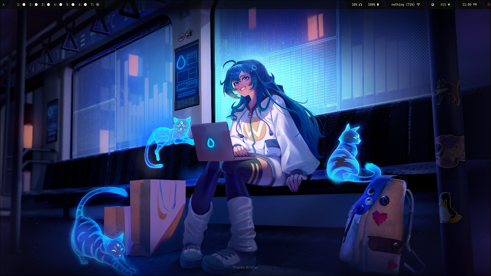
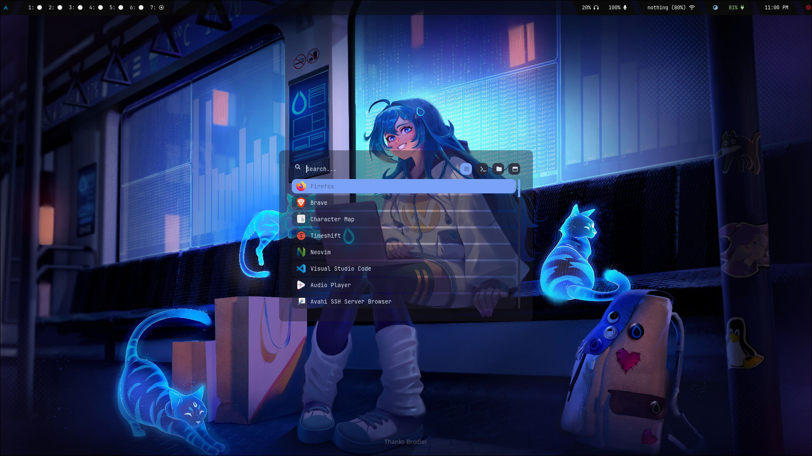

# 🐧 My Arch Linux Dotfiles

Welcome to my personal dotfiles repository! This repository contains my custom configurations for a minimalist, high-performance Wayland environment using Hyprland.


<p align="center">

  
  
  
  

</p>

---

## 🛠️ Required Core Software

Ensure these primary applications are installed before deploying the configuration files:

*   **Window Manager:** `hyprland`
*   **Status Bar:** `waybar`
*   **Application Launcher:** `rofi-wayland` *(Note: Use the Wayland-native fork, not standard X11 Rofi)*
*   **Text Editor:** `neovim`
*   **Terminal Emulator:** `kitty` *(or your preferred terminal)*

---

## 📦 System Dependencies & Ecosystem

Install these desktop components and backend utilities to provide full lockscreen, notification, wallpaper, screenshot, and nightlight functionality:

### 🎨 Hyprland Ecosystem Components
*   **Wallpaper Engine:** `hyprpaper` — Fast, IPC-controlled wallpaper utility.
*   **Lock Screen:** `hyprlock` — Fast, secure, and highly customizable lockscreen utility.
*   **Screenshot Tool:** `hyprshot` — Mouse-driven utility to capture windows, regions, or monitors.
*   **Night Light / Blue-Light Filter:** `hyprsunset` — Native gamma shader utility to reduce eye strain.

### 🔔 Desktop Utilities
*   **Notification Center:** `swaync` — SwayNotificationCenter, a sleek control panel and notification daemon.
*   **Clipboard Manager:** `wl-clipboard` — Native terminal clipboard integration.
*   **Audio & Media Controls:** `pipewire`, `wireplumber`, `playerctl`, `pavucontrol` — Backend audio stack management.
*   **Hardware Control:** `brightnessctl` — Screen brightness management.

### 💻 Neovim Core Dependencies
*   **Git:** `git` (Required for plugin managers like Lazy.nvim)
*   **Build Tools:** `make` / `cmake` (Required for compiling fuzzy finders like telescope-fzf-native)
*   **Archive Utility:** `unzip` (Required by Mason for extracting Language Servers)
*   **Search Tool:** `ripgrep` (Fast text searching inside Neovim)

---

## 🔤 Font Requirements

To prevent broken icons or missing text blocks (tofu boxes) in Waybar, Rofi, and Neovim, you must install these fonts:

### 1. Icon & Glyph Fonts (Critical)
*   **Feather Icons:** Lightweight, clean icons heavily utilized in minimalist Waybar setups.
    *   *Package:* `ttf-feather-icons` (AUR)
*   **Nerd Fonts:** Provides symbols for Neovim status lines, file trees, and system prompts.
    *   *Package:* `ttf-jetbrains-mono-nerd`
*   **Font Awesome:** Used heavily by standard Waybar modules.
    *   *Package:* `otf-font-awesome`

### 2. Interface & System Fonts
*   **Monospace Font:** `ttf-jetbrains-mono` (Recommended for the terminal and Neovim)
*   **Emoji Support:** `noto-fonts-emoji` (For proper system-wide emoji rendering)

---

## 🚀 Quick Installation (Arch Linux)

You can install all the required packages at once using `pacman` and an AUR helper like `yay` or `paru`:
```bash
```
```bash
# 1. Install official repository dependencies
sudo pacman -S hyprland waybar neovim kitty git \
  hyprpaper hyprlock hyprshot hyprsunset swaync \
  wl-clipboard pipewire wireplumber playerctl brightnessctl pavucontrol \
  ripgrep make cmake unzip \
  ttf-jetbrains-mono ttf-jetbrains-mono-nerd otf-font-awesome noto-fonts-emoji

# 2. Install Wayland-specific Rofi and Feather fonts from the AUR
yay -S rofi-wayland ttf-feather-icons
```

